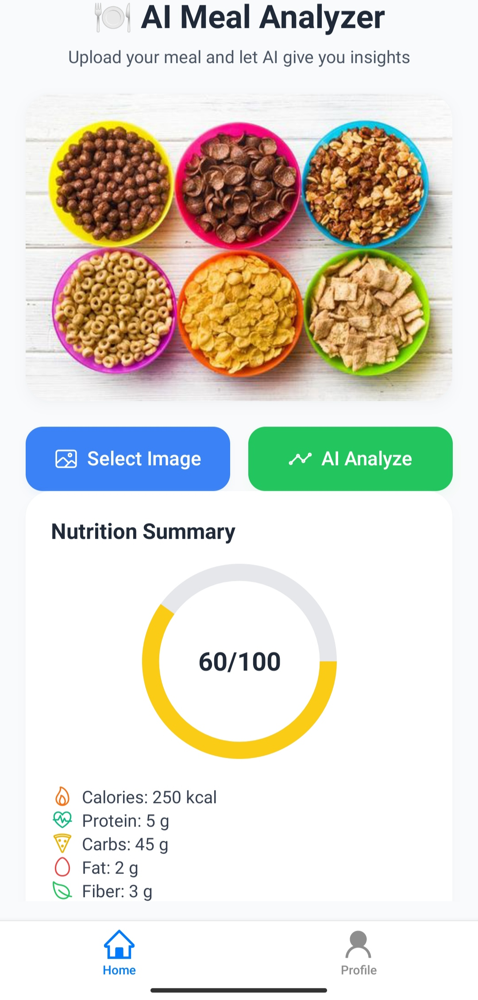
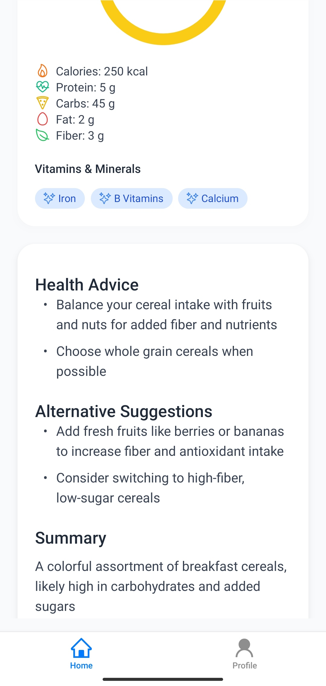

# NutriSnap

An AI-powered meal analyzer with a React Native mobile app and Express backend. Upload a food photo and get an instant nutritional breakdown, health score, and dietary advice powered by Groq's Llama 4 Scout Vision model.

## Features

- **Image Analysis**: Upload meal photos for AI-powered nutritional analysis
- **Nutrition Breakdown**: Calories, protein, carbs, fats, fiber, and key vitamins and minerals
- **Health Score**: 0-100 rating with personalized explanations
- **Health Advice**: AI-generated recommendations based on meal composition
- **Alternative Suggestions**: Healthier substitutes while maintaining similar flavors
- **Authentication**: Clerk sign-in/sign-up with email/password and Google OAuth
- **Modern UI**: NativeWind, TailwindCSS for React Native
- **Cross-Platform**: Works on iOS and Android

## Screenshots

<div align="center">

### Authentication

<p>
  
  
</p>

### Main Features

<p>
  
  
  
</p>

### Analysis Results

<p>
  
  

</p>

</div>

## Tech Stack

### Mobile App

- [Expo](https://expo.dev) with Expo Router
- TypeScript
- NativeWind
- Clerk authentication
- React Native Reanimated

### Backend Server

- [Bun](https://bun.sh/) runtime
- Express
- LangChain with Groq Chat Model
- Zod
- dotenv

## Prerequisites

- [Node.js](https://nodejs.org/) v18+
- [Bun](https://bun.sh/)
- [Expo Go](https://expo.dev/go) app on your mobile device

## Getting Started

### 1. Clone the repository

```bash
git clone <your-repository-url>
cd NutriSnap
```

### 2. Configure the mobile app

Create `mobile/.env.local`:

```env
EXPO_PUBLIC_CLERK_PUBLISHABLE_KEY=your_clerk_key
EXPO_PUBLIC_SERVER_URL=http://your-local-ip:3000
```

### 3. Configure the backend server

```bash
cd server
bun install
cp .env.example .env
```

Edit `server/.env` and add your `GROQ_API_KEY`.

```env
PORT=3000
NODE_ENV=development
GROQ_API_KEY=your_groq_api_key
```

### 4. Run the backend

```bash
cd server
bun run dev
```

### 5. Run the mobile app

```bash
cd mobile
npm install
npm run start -- -c
```

Scan the QR code with Expo Go on your device.

> On a physical Android device, set `EXPO_PUBLIC_SERVER_URL` in `mobile/.env.local` to your computer's LAN IP, for example `http://192.168.1.69:3000`.

## API

### `POST /api/aifood`

Analyzes a food image and returns nutritional data.

Request:

```json
{
  "image": "<base64-encoded-image>"
}
```

Response:

```json
{
  "message": "```json\n{ ... nutrition data ... }\n```\n\n## Health Advice\n..."
}
```

Error responses:

- `400`: No image provided
- `422`: Image does not contain food, or AI returned invalid data
- `500`: Server error

### `GET /health`

Health check endpoint.

```json
{ "status": "ok" }
```

## Scripts

### Mobile App

```bash
cd mobile
npm run start -- -c
npm run android
npm run ios
npm run lint
```

### Server

```bash
cd server
bun run dev
bun run start
bun run typecheck
```

## Backend Architecture

The backend is organized by responsibility so the route layer stays thin and AI-specific behavior is isolated.

```text
server/src
├── app.ts                         # Express app wiring
├── server.ts                      # HTTP listener
├── config                         # Environment and AI model setup
├── constants                      # Shared constants
├── controllers                    # Request/response handlers
├── errors                         # Application error classes
├── middleware                     # Validation, logging, async, 404, error handling
├── parsers                        # AI output validation and response formatting
├── prompts                        # LangChain prompt definitions
├── routes                         # API route declarations
├── schemas                        # Zod request and AI response schemas
├── services                       # Business logic and AI orchestration
├── types                          # Shared TypeScript types
└── utils                          # Logger and image helpers
```

### Request Flow

`POST /api/aifood` follows this path:

```text
route -> validation middleware -> controller -> AI service -> prompt -> ChatGroq structured output -> Zod parser -> formatted response
```

The mobile app still receives the same compatible response shape:

```json
{
  "message": "```json\n{ ... nutrition data ... }\n```\n\n## Health Advice\n..."
}
```

### LangChain and Structured Output

The AI service uses `ChatGroq` from `@langchain/groq` through a LangChain prompt pipeline. The prompt lives in `src/prompts/nutrition.prompt.ts`, while model construction lives in `src/config/ai.ts`. The service calls the model with `withStructuredOutput(nutritionAnalysisSchema)`, so the LLM response is expected to match the Zod schema before the backend formats it for the mobile app.

### Zod Validation

Zod validates three boundaries:

- Environment variables in `src/config/env.ts`
- Request bodies in `src/schemas/request.schema.ts`
- AI nutrition output in `src/schemas/nutrition.schema.ts`

Invalid requests return `400`. Non-food images or invalid AI nutrition data return `422`. Unexpected server failures return `500` without exposing stack traces outside development.

### Adding a New AI Endpoint

To add another AI endpoint:

1. Create request and response schemas in `src/schemas`.
2. Add the prompt in `src/prompts`.
3. Add parsing or formatting logic in `src/parsers` if the mobile response needs a specific shape.
4. Add service logic in `src/services`.
5. Add a controller method in `src/controllers`.
6. Register the endpoint in `src/routes`.

Keep prompts, model setup, validation, and HTTP response handling in separate files so future model providers can be swapped with minimal changes.
