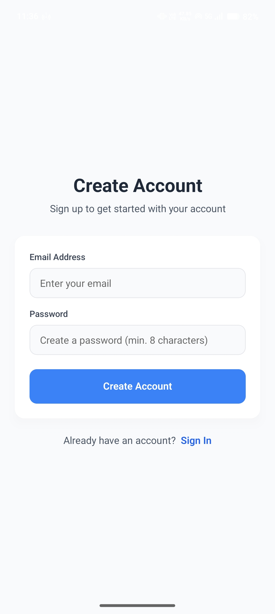
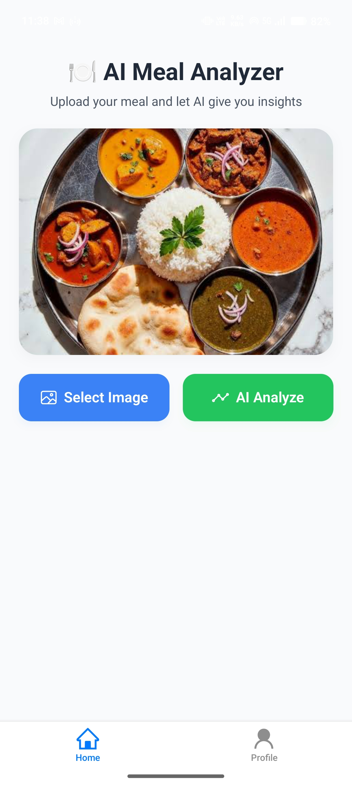
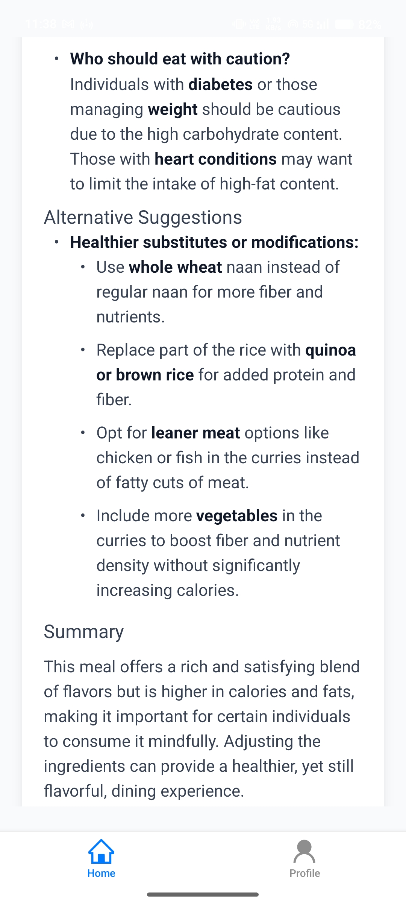

# 🍽️ Meal Analyzer

An intelligent React Native mobile application that uses AI to analyze food images and provide comprehensive nutritional information, health advice, and dietary recommendations.

## ✨ Features

- 📸 **Image Analysis**: Upload or capture photos of meals for instant AI-powered nutritional analysis
- 🔢 **Detailed Nutrition Breakdown**: Get comprehensive data on calories, protein, carbs, fats, fiber, and key vitamins & minerals
- 📊 **Health Score**: Receive a 0-100 health rating for each meal with personalized explanations
- 💡 **Personalized Health Advice**: AI-generated recommendations based on meal composition
- 🔄 **Alternative Suggestions**: Get healthier substitutes while maintaining similar flavors
- 🔐 **Authentication**: Secure sign-in/sign-up with Clerk (supports email/password and Google OAuth)
- 👤 **User Profiles**: Personalized user experience with profile management
- 🎨 **Modern UI**: Beautiful interface built with NativeWind (TailwindCSS for React Native)
- 📱 **Cross-Platform**: Works seamlessly on iOS and Android

## � Screenshots

<div align="center">

### Authentication

<p>
  
  
</p>

### Main Features

<p>
  
  
  
</p>

### Analysis Results

<p>
  
  
  
</p>

</div>

## �🛠️ Tech Stack

- **Framework**: [Expo](https://expo.dev) (~54.0)
- **Language**: TypeScript
- **Navigation**: Expo Router (file-based routing)
- **UI**: NativeWind (TailwindCSS for React Native)
- **AI**: OpenAI GPT-4 Vision API
- **Authentication**: Clerk
- **Animations**: React Native Reanimated

## 📋 Prerequisites

Before you begin, ensure you have the following installed:

- [Node.js](https://nodejs.org/) (v18 or higher)
- [Bun](https://bun.sh/) or npm
- [Expo CLI](https://docs.expo.dev/get-started/installation/)
- [Expo Go](https://expo.dev/go) app on your mobile device (for testing)

## 🚀 Getting Started

### 1. Clone the repository

```bash
git clone <your-repository-url>
cd Meal_Analyzer
```

### 2. Install dependencies

```bash
bun install
# or
npm install
```

### 3. Set up environment variables

Create a `.env` file in the root directory and add your API keys:

```env
OPENAI_API_KEY=your_openai_api_key_here
EXPO_PUBLIC_CLERK_PUBLISHABLE_KEY=your_clerk_publishable_key_here
```

To get your API keys:

- **OpenAI**: Sign up at [OpenAI Platform](https://platform.openai.com/)
- **Clerk**: Create an account at [Clerk.com](https://clerk.com/)

### 4. Start the development server

```bash
bun start
# or
npm start
```

### 5. Run on your device

Scan the QR code with:

- **iOS**: Camera app
- **Android**: Expo Go app

Or run on emulator/simulator:

```bash
# Android
bun android

# iOS
bun ios
```

## 📁 Project Structure

```
Meal_Analyzer/
├── src/
│   ├── app/
│   │   ├── _layout.tsx              # Root layout
│   │   ├── (app)/                   # Authenticated routes
│   │   │   ├── _layout.tsx
│   │   │   ├── sign-in.tsx          # Sign in screen
│   │   │   ├── sign-up.tsx          # Sign up screen
│   │   │   └── (tabs)/              # Tab navigation
│   │   │       ├── _layout.tsx
│   │   │       ├── index.tsx        # Home/Analyzer screen
│   │   │       └── profile.tsx      # User profile screen
│   │   └── api/
│   │       └── aifood+api.ts        # OpenAI API integration
│   └── components/
│       └── GoogSignIn.tsx           # Google OAuth component
├── assets/
│   └── images/                      # App icons and images
├── app.json                         # Expo configuration
├── package.json                     # Dependencies
├── tsconfig.json                    # TypeScript configuration
└── tailwind.config.js               # TailwindCSS configuration
```

## 🎯 Usage

1. **Sign Up/Sign In**: Create an account or sign in with email/password or Google
2. **Take or Upload Photo**: Choose a meal image from your gallery or take a new photo
3. **Analyze**: The AI will process the image and provide:
   - Nutritional breakdown
   - Health score (0-100)
   - Detailed health advice
   - Alternative suggestions
4. **Review Results**: View comprehensive analysis with visual progress indicators

## 🔧 Available Scripts

```bash
bun start          # Start the Expo development server
bun android        # Run on Android emulator/device
bun ios            # Run on iOS simulator/device
bun web            # Run in web browser
bun lint           # Run ESLint
```

## 🏗️ Building for Production

### Using EAS Build

```bash
# Install EAS CLI
npm install -g eas-cli

# Configure EAS
eas build:configure

# Build for Android
eas build --platform android

# Build for iOS
eas build --platform ios
```
