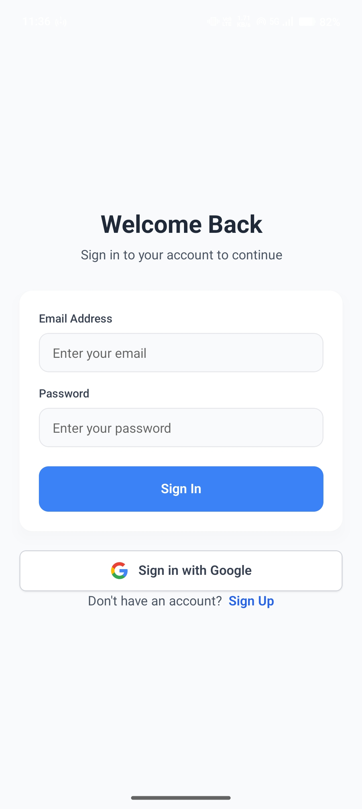
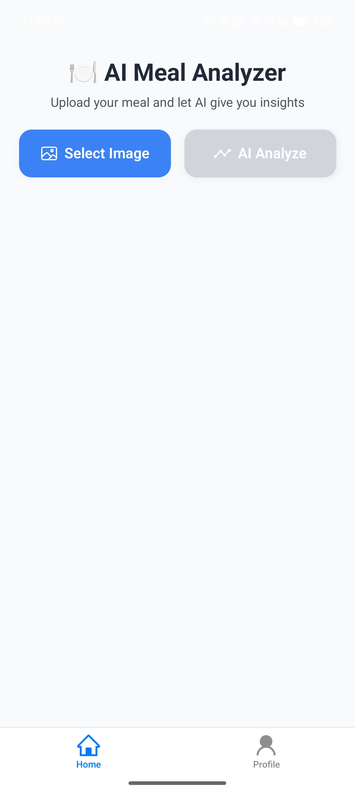
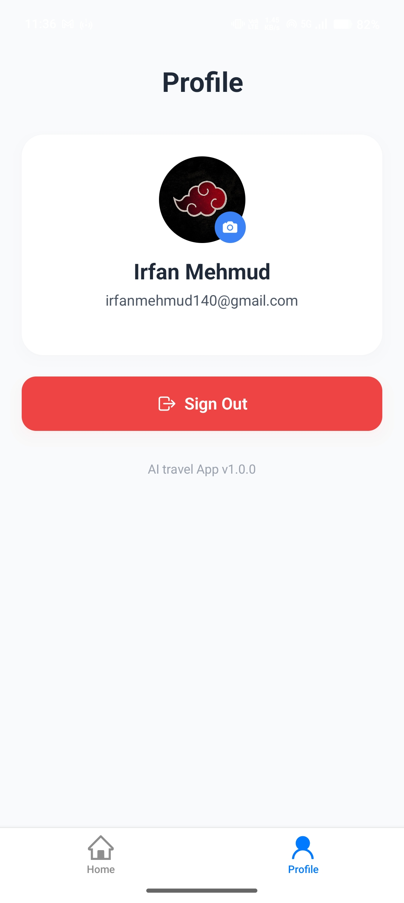
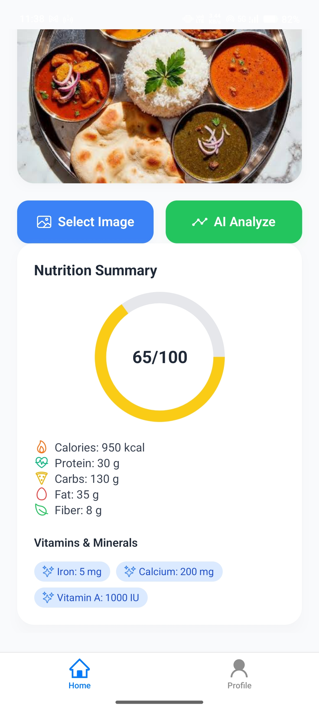
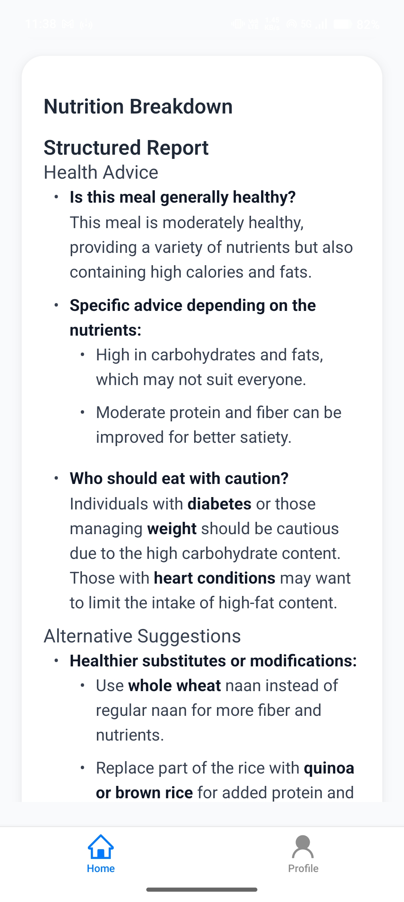

# NutriSnap

An AI-powered meal analyzer with a React Native mobile app and Express backend. Upload a food photo and get an instant nutritional breakdown, health score, and dietary advice powered by Groq's Llama 4 Scout Vision model.

## Features

- **Image Analysis**: Upload meal photos for AI-powered nutritional analysis
- **Nutrition Breakdown**: Calories, protein, carbs, fats, fiber, and key vitamins and minerals
- **Health Score**: 0-100 rating with personalized explanations
- **Health Advice**: AI-generated recommendations based on meal composition
- **Alternative Suggestions**: Healthier substitutes while maintaining similar flavors
- **Authentication**: Clerk sign-in/sign-up with email/password and Google OAuth
- **Modern UI**: NativeWind, TailwindCSS for React Native
- **Cross-Platform**: Works on iOS and Android

## Screenshots

<div align="center">

### Authentication

<p>
  
  
</p>

### Main Features

<p>
  
  
  
</p>

### Analysis Results

<p>
  
  
  
</p>

</div>

## Tech Stack

### Mobile App

- [Expo](https://expo.dev) with Expo Router
- TypeScript
- NativeWind
- Clerk authentication
- React Native Reanimated

### Backend Server

- [Bun](https://bun.sh/) runtime
- Express
- Groq SDK

## Prerequisites

- [Node.js](https://nodejs.org/) v18+
- [Bun](https://bun.sh/)
- [Expo Go](https://expo.dev/go) app on your mobile device

## Getting Started

### 1. Clone the repository

```bash
git clone <your-repository-url>
cd NutriSnap
```

### 2. Configure the mobile app

Create `mobile/.env.local`:

```env
EXPO_PUBLIC_CLERK_PUBLISHABLE_KEY=your_clerk_key
EXPO_PUBLIC_SERVER_URL=http://your-local-ip:3000
```

### 3. Configure the backend server

```bash
cd server
bun install
cp .env.example .env
```

Edit `server/.env` and add your `GROQ_API_KEY`.

### 4. Run the backend

```bash
cd server
bun run dev
```

### 5. Run the mobile app

```bash
cd mobile
npm install
npm run start -- -c
```

Scan the QR code with Expo Go on your device.

> On a physical Android device, set `EXPO_PUBLIC_SERVER_URL` in `mobile/.env.local` to your computer's LAN IP, for example `http://192.168.1.69:3000`.

## API

### `POST /api/aifood`

Analyzes a food image and returns nutritional data.

Request:

```json
{
  "image": "<base64-encoded-image>"
}
```

Response:

```json
{
  "message": "```json\n{ ... nutrition data ... }\n```\n\n## Health Advice\n..."
}
```

Error responses:

- `400`: No image provided
- `422`: Image does not contain food, or AI returned invalid data
- `500`: Server error

### `GET /health`

Health check endpoint.

```json
{ "status": "ok" }
```

## Scripts

### Mobile App

```bash
cd mobile
npm run start -- -c
npm run android
npm run ios
npm run lint
```

### Server

```bash
cd server
bun run dev
bun run start
```
