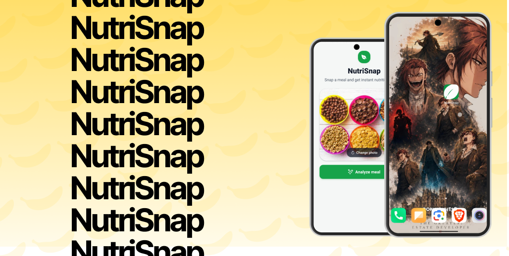
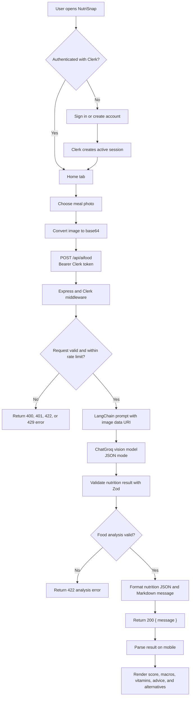

# NutriSnap

NutriSnap is a mobile AI meal analyzer built with Expo and React Native. Users sign in, choose a meal photo, and receive an AI-generated nutrition breakdown with calories, macronutrients, fiber, vitamins and minerals, a health score, practical advice, and healthier alternatives.

## Demo

  

## Features

- **Meal photo analysis** - Choose a food image from the device gallery and send it to the analysis API.
- **Nutrition breakdown** - Display calories, protein, carbohydrates, fat, fiber, and key vitamins and minerals.
- **Health score** - Show a 0-100 score with an explanation of the result.
- **AI guidance** - Render practical health advice, healthier alternatives, and a meal summary as Markdown.
- **Authentication** - Clerk email/password sign-in, email verification during sign-up, and Google sign-in.
- **Protected app navigation** - Authenticated users access the Home and Profile tabs; unauthenticated users are routed to sign-in or sign-up.
- **Input and response validation** - Zod validation is used on both the mobile client and server.
- **API protection** - The analysis endpoint requires a valid Clerk token and is limited to 20 requests per user per hour.

## Tech Stack

### Mobile

- Expo SDK 55 and Expo Router
- React Native and TypeScript
- Clerk Expo authentication
- Expo Image Picker
- React Native Markdown Display
- React Native Circular Progress
- Zod

### Server

- Bun runtime
- Express
- Clerk Express authentication
- LangChain with `ChatGroq`
- Groq vision model
- Zod nutrition and request schemas
- Pino request and application logging
- CORS and Express rate limiting

## Flow

```mermaid
flowchart TD
    A[User opens NutriSnap] --> B{Authenticated with Clerk?}
    B -->|No| C[Sign in or create account]
    C --> D[Clerk creates active session]
    B -->|Yes| E[Home tab]
    D --> E
    E --> F[Choose meal photo]
    F --> G[Convert image to base64]
    G --> H[POST /api/aifood\nBearer Clerk token]
    H --> I[Express and Clerk middleware]
    I --> J{Request valid and within rate limit?}
    J -->|No| K[Return 400, 401, 422, or 429 error]
    J -->|Yes| L[LangChain prompt with image data URI]
    L --> M[ChatGroq vision model\nJSON mode]
    M --> N[Validate nutrition result with Zod]
    N --> O{Food analysis valid?}
    O -->|No| P[Return 422 analysis error]
    O -->|Yes| Q[Format nutrition JSON and Markdown message]
    Q --> R["Return 200 { message }"]
    R --> S[Parse result on mobile]
    S --> T[Render score, macros, vitamins, advice, and alternatives]
```

1. Clerk protects the mobile app and supplies a bearer token for authenticated requests.
2. The user chooses a meal image from the gallery. The mobile app sends its base64 content to `POST /api/aifood`.
3. Express validates the Clerk session, request body, image format, image size, and per-user request limit.
4. The AI service sends the image to the Groq vision model through LangChain and requests a JSON nutrition analysis.
5. The server validates the model output with Zod, rejects non-food or invalid results, and formats successful results as a JSON code block plus Markdown guidance.
6. The mobile app parses the `{ message }` response and renders the health score, nutrition rows, vitamins, advice, alternatives, and summary. The server also exposes `GET /health` for health checks.
